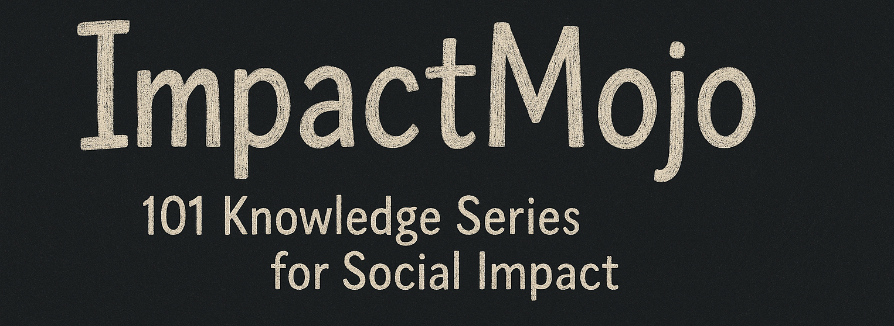

# ImpactMojo 101 Knowledge Series

A collection of open, 60-slide learning decks on critical development, equity, climate, gender, and justice topics in South Asia. These decks are designed for educators, practitioners, facilitators, and learners seeking clarity, context, and well-researched materials — free to use and adapt.

## ✅ Features
- South Asia–specific examples and evidence
- Built for use in workshops, classrooms, and onboarding
- Creative Commons licensed (CC BY-NC-SA 4.0)
- Available in PDF, PPTX, and editable formats

## 📬 License & Usage
This repository and its contents are freely shareable with attribution. See [LICENSE](LICENSE) for terms.

## 🧾 Citation
To cite this work, see [CITATION.cff](CITATION.cff)

---
© ImpactMojo / InsightStack, curated by Varna Sri Raman